<h3><code>daksh@github ~ $ ./contributions.sh</code></h3>

  

<h3><code>daksh@github ~ $ whoami</code></h3>
<table>
<tr>
<td valign="top"></td>
<td valign="top"></td>
</tr>
</table>

 
<code>daksh@github ~ $ cat current-focus.txt</code>
  
<code>Java / Spring Boot</code> &nbsp;
<code>Python / FastAPI</code> &nbsp;
<code>AI / ML / GenAI</code> &nbsp;
<code>PostgreSQL / SQL</code> &nbsp;
<code>DSA / LeetCode</code>
  
Animated SVGs • No JavaScript • No third-party GitHub stats service

