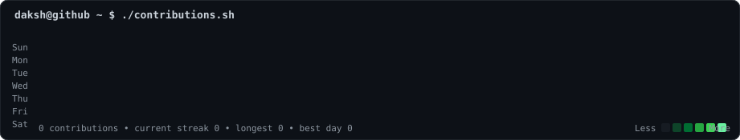
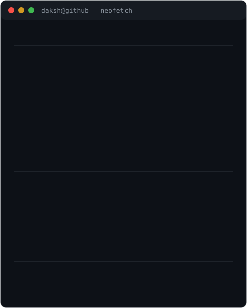

<h3><code>daksh@github ~ $ ./contributions.sh</code></h3>

  

<h3><code>daksh@github ~ $ whoami</code></h3>
<table>
<tr>
<td valign="top"></td>
<td valign="top"></td>
</tr>
</table>

 

<code>daksh@github ~ $ cat profile.txt</code>

I’m **Daksh Sharma**, a Computer Science student building backend systems and practical AI products. My primary direction is **Java and Spring Boot backend engineering**, supported by hands-on work with **Python, FastAPI, PostgreSQL, REST APIs, AI/ML, and GenAI**.

I enjoy taking an idea through the full build: shaping APIs and data models, implementing backend logic, integrating AI services, handling reliability concerns, and shipping a useful product. I’m especially interested in the intersection of **AI engineering and security**.

<code>Java / Spring Boot</code> &nbsp;
<code>Python / FastAPI</code> &nbsp;
<code>AI / ML / GenAI</code> &nbsp;
<code>AI Security</code> &nbsp;
<code>PostgreSQL / SQL</code> &nbsp;
<code>DSA / Java</code>

 

## `daksh@github ~ $ ls featured-projects/`

<table>
<tr>
<td width="50%" valign="top">

### DataGhost — AI Privacy Guardian
Privacy analysis and document-sanitization platform for finding risky information before it is shared. Built around OCR, PII, QR, EXIF, and context-aware risk analysis, with smart redaction and sanitized exports.

`FastAPI` `Next.js` `TypeScript` `AI/NLP` `Privacy Engineering`

[View repository →](https://github.com/daksh1136/DataGhost)

</td>
<td width="50%" valign="top">

### ScamShield — AI Scam Message Analyzer
Security-focused message analysis service that combines AI assessment with deterministic fallback rules, returning a clear risk score and severity when external AI services are unavailable.

`Python` `FastAPI` `LLM APIs` `Security Heuristics`

[View repository →](https://github.com/daksh1136/ScamShield)

</td>
</tr>
<tr>
<td width="50%" valign="top">

### WorkForge — Meeting Intelligence Engine
Turns meeting content into structured objectives, tasks, decisions, risks, and unresolved items through an orchestrated multi-agent workflow.

`FastAPI` `React` `Vite` `Gemini API` `Agentic AI`

[View repository →](https://github.com/daksh1136/WorkForge)

</td>
<td width="50%" valign="top">

### RecodeAI — Code Analysis Platform
Developer tooling that combines backend APIs and intelligent analysis to help reason about source code and AI-assisted development workflows.

`Backend APIs` `Code Analysis` `AI Developer Tools`

[View repository →](https://github.com/daksh1136/RecodeAI)

</td>
</tr>
<tr>
<td width="50%" valign="top">

### ProjectPulse — Project Risk Monitoring
Intelligent project-monitoring platform that turns project data into actionable signals through REST APIs, PostgreSQL, and an AI risk engine.

`Python` `FastAPI` `PostgreSQL` `REST APIs`

[View repository →](https://github.com/daksh1136/SIH-26103)

</td>
<td width="50%" valign="top">

### LandslideAI — Disaster Risk Monitoring
Early-warning prototype that evaluates rainfall, slope, and soil-moisture signals to classify landslide risk for monitored locations.

`FastAPI` `React` `Leaflet` `Risk Scoring`

[View repository →](https://github.com/daksh1136/SIH26001-LandslideAI)

</td>
</tr>
<tr>
<td width="50%" valign="top">

### StartupPilot AI — Startup Decision Support
AI-focused product exploration centered on helping founders structure ideas, assess decisions, and move from early concepts to action.

`AI Product Development` `Decision Support` `GenAI`

</td>
<td width="50%" valign="top">

### URL Shortener — Backend Service
Backend-focused URL shortening service built with persistent storage and REST API concepts.

`Flask` `SQLAlchemy` `PostgreSQL` `REST API`

[View repository →](https://github.com/daksh1136/CodeAlpha_URLShortener)

</td>
</tr>
</table>

 

## `daksh@github ~ $ cat backend-runway.txt`

### Java Internship Runway
My structured path from core Java and object-oriented programming to production-minded backend development. I’m building depth in Java, DSA, Spring Boot, Spring Data JPA, Hibernate, security, and REST API design.

`Java` `OOP` `DSA` `Spring Boot` `Backend Fundamentals`

[View repository →](https://github.com/daksh1136/Java-Internship-Runway)

 

## `daksh@github ~ $ cat stack.txt`

| Area | Tools and focus |
| --- | --- |
| Backend | Java, Spring Boot, Python, FastAPI, Flask, REST APIs, SQLAlchemy |
| Data | PostgreSQL, SQL, database design |
| AI | Machine learning, LLM APIs, GenAI, Ollama, AI service integration |
| Engineering | Git, GitHub, Maven, Docker, Postman, debugging, deployment |
| Security direction | Privacy-aware AI, risk analysis, secure AI applications |

 

## `daksh@github ~ $ cat current-focus.txt`

- Building production-minded Java and Spring Boot APIs.
- Strengthening DSA and problem solving in Java.
- Developing AI-powered backend systems with thoughtful fallbacks and data handling.
- Exploring AI security through privacy, scam detection, and risk-analysis products.

 

<h3><code>daksh@github ~ $ connect</code></h3>

  

Animated local SVGs • No JavaScript • No third-party GitHub stats service
 
Build systems. Learn deeply. Ship useful work.

